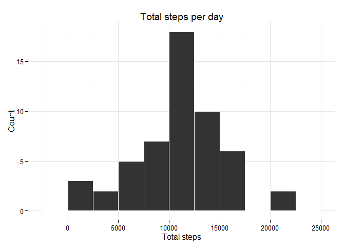
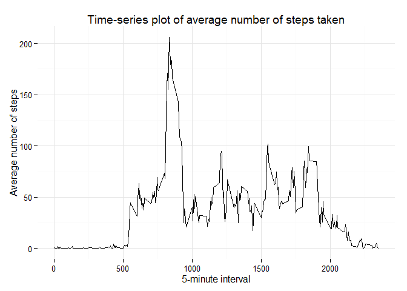
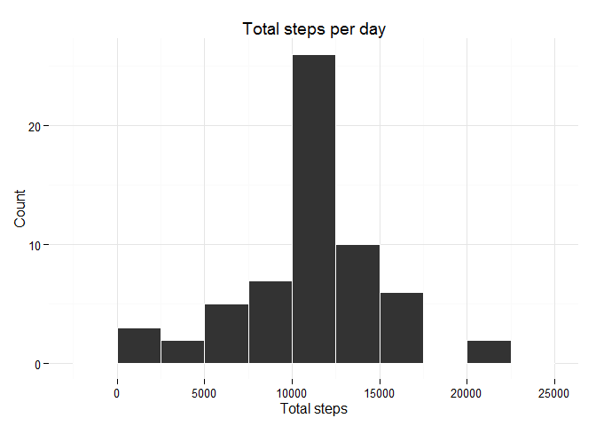
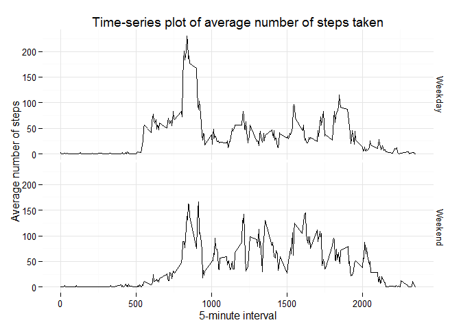

# Reproducible Research: Peer Assessment 1

## Synopsis
This report aims to analyze data from personal activity monitoring device (such as a Fitbit, Nike Fuelband, or Jawbone Up). This device collects data at 5 minute intervals through out the day. The data consists of two months of data from an anonymous individual collected during the months of October and November, 2012 and include the number of steps taken in 5 minute intervals each day. 

## Loading and preprocessing the data

For this assigment, `dplyr` and `ggplot2` libraries will be used.


```r
library("dplyr"); library("ggplot2")
```

```
## Warning: package 'dplyr' was built under R version 3.1.3
```

Data to be analyzed is contained in zip archive, therefore file is firstly unzipped and then read into a data frame with `read.csv` command. Afterwards, `str` command is used to show data frame structure.


```r
unzipped_file <- unzip("activity.zip")
activity <- read.csv(unzipped_file)
```


```r
str(activity)
```

```
## 'data.frame':	17568 obs. of  3 variables:
##  $ steps   : int  NA NA NA NA NA NA NA NA NA NA ...
##  $ date    : Factor w/ 61 levels "2012-10-01","2012-10-02",..: 1 1 1 1 1 1 1 1 1 1 ...
##  $ interval: int  0 5 10 15 20 25 30 35 40 45 ...
```

The data column was read from csv as a factor. It's changed to data format with 'as.Date' command.


```r
activity$date <- as.Date(activity$date)
```

In the data file there is 2,304 rows with NAs. For this part of the assignment, the missing values in the dataset will be ignored. New data set, without missing values, is built.


```r
activity2 <- activity[!is.na(activity$steps),]
```

## What is mean total number of steps taken per day?

Firstly, the total number of steps taken per day is calculated.


```r
activity_steps_day <- activity2 %>%
        group_by(date) %>%
        summarise(suma = sum(steps))
head(activity_steps_day,3)
```

```
## Source: local data frame [3 x 2]
## 
##         date  suma
## 1 2012-10-02   126
## 2 2012-10-03 11352
## 3 2012-10-04 12116
```

Histogram of steps taken is built using ggplot2 package.


```r
g <- ggplot(activity_steps_day, aes(suma)) 
g <- g + geom_histogram(binwidth = 2500,col=I("white"))
g <- g + xlab("Total steps") + ylab("Count") + ggtitle("Total steps per day")
g <- g + theme_minimal()
print(g)
```

 

Lastly, the mean and median of the total number of steps taken per day are counted.


```r
cat("mean = ",mean(activity_steps_day$suma),", median = ",median(activity_steps_day$suma))
```

```
## mean =  10766.19 , median =  10765
```

## What is the average daily activity pattern?

The average number of steps taken is calculated, averaged across all days.


```r
activity_avg_daily_act <- activity2 %>%
        group_by(interval) %>%
        summarise(avg = mean(steps))
```

Time-series plot of average number of steps taken is also built using ggplot2 package. 5-minute interval in on x-axis, the average number of steps taken is on y-axis.


```r
g <- ggplot(activity_avg_daily_act, aes(x=interval, y=avg)) 
g <- g + geom_line()
g <- g + xlab("5-minute interval") + ylab("Average number of steps") + ggtitle("Time-series plot of average number of steps taken")
g <- g + theme_minimal()
print(g)
```

 

Calculation of 5-minute interval that contains the maximum number of steps on average across all the days in the dataset.


```r
max_steps_int <- activity_avg_daily_act[activity_avg_daily_act$avg==max(activity_avg_daily_act$avg),][1]
max_steps_int
```

```
## Source: local data frame [1 x 1]
## 
##   interval
## 1      835
```
On average (across all the days in the dataset), in 835 interval, there is 206 steps taken.

## Imputing missing values

Original dataset contains missing values. Those will be replaced by the mean of 5 minute interval. For each interval mean is calculated across all days and the results are used to replace missing values.


```r
activityMVF <- data.frame() #new data frame
for (i in unique(activity$interval)){
        tmp <- filter(activity,activity$interval==i) #filter rows for given interval
        tmp[is.na(tmp$steps),]$steps = mean(tmp$steps,na.rm = TRUE) #replace with mean
        activityMVF <- rbind(activityMVF,tmp) #bind rows to new data frame
}
```

Next, there is a quick check whether the new data set has the same dimension as the original one.


```r
dim(activityMVF)
```

```
## [1] 17568     3
```

```r
dim(activity)
```

```
## [1] 17568     3
```

Grouping and summarizing data to see how many steps were taken each day.


```r
activityMVFs <- activityMVF %>%
        group_by(date) %>%
        summarise(suma = sum(steps))
```

Histogram of the total number of steps taken each day.


```r
g <- ggplot(activityMVFs, aes(suma)) 
g <- g + geom_histogram(binwidth = 2500,col=I("white"))
g <- g + xlab("Total steps") + ylab("Count") + ggtitle("Total steps per day")
g <- g + theme_minimal()
print(g)
```

 

Lastly, the mean and median of the total number of steps taken per day are calculated for this new data set.


```r
cat("mean = ",mean(activityMVFs$suma),", median = ",median(activityMVFs$suma))
```

```
## mean =  10766.19 , median =  10766.19
```

Those mean and median are now compared with the estimates from the first part of the assignment to see if there is any difference.


```r
cat("difference between means is ",mean(activityMVFs$suma) - mean(activity_steps_day$suma))
```

```
## difference between means is  0
```

```r
cat("difference between medians is ",median(activityMVFs$suma) - median(activity_steps_day$suma))
```

```
## difference between medians is  1.188679
```
Means are equal. Difference between medians is 1.19. In the data set with filled missing values, mean and median are equal - data distribution is symmetric.

## Are there differences in activity patterns between weekdays and weekends?

Creating new factor variable in the dataset with two levels "weekday" and "weekend" indicating whether a given date is a weekday or weekend day. 


```r
Sys.setlocale("LC_TIME", "English") #days of the week should be in English
```

```
## [1] "English_United States.1252"
```

```r
activityMVF$day <- ifelse(weekdays(as.Date(activityMVF$date)) == "Saturday" | weekdays(as.Date(activityMVF$date)) == "Sunday","Weekend","Weekday") 
activityMVF$day <- as.factor(activityMVF$day)
```
Grouping data by day type and interval.


```r
activityMVFdays <- activityMVF %>%
        group_by(day,interval) %>%
        summarise(steps.average = mean(steps))
```
Panel plot containing a time series plot of the 5-minute interval (x-axis) and the average number of steps taken, averaged across all weekday days or weekend days (y-axis). 


```r
g <- ggplot(activityMVFdays, aes(x=interval, y=steps.average)) 
g <- g + geom_line() + facet_grid(day~.)
g <- g + xlab("5-minute interval") + ylab("Average number of steps") + ggtitle("Time-series plot of average number of steps taken")
g <- g + theme_minimal()
print(g)
```

 

From the plot above, noticable diffrence is visible beetween the weekdays and weekends. On the weekdays, there is a peak in the activity around 800th interval. For rest of the intervals, on average, there is 50% or less steps. Weekends have also peak in simmilar interval, but it's smaller and distribution of steps during the day is more even.
